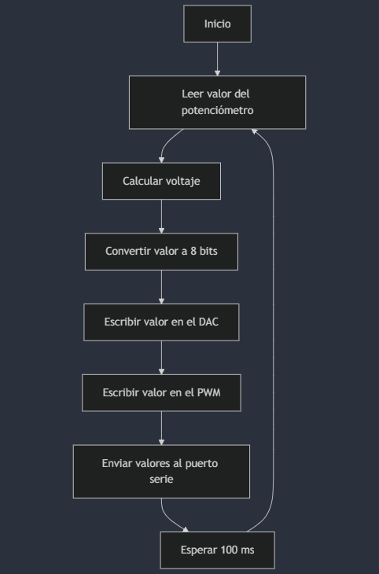
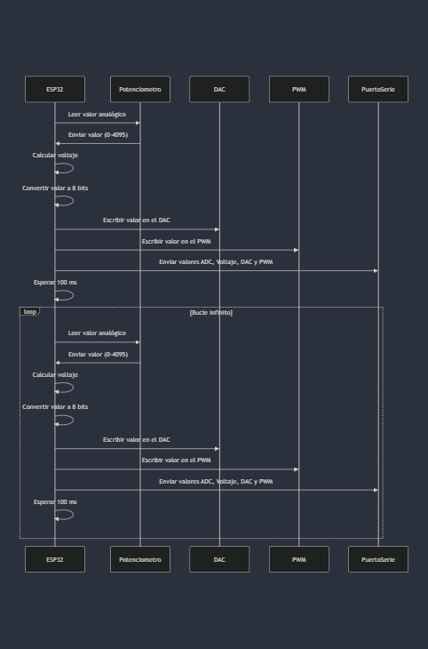

# Práctica 1: Blink con ESP32-WROOM-32D

Ejercicios extra de la practica 1

Proyecto para leer datos de un potenciómetro, tratar esos datos y sacarlos por otro pin del ESP32.

## Código
El código principal se encuentra en `src/main.cpp`.

## Diagrama de Flujo (Ejercicio 1 voluntario)

## Diagrama de tiempos (Ejercicio 1 voluntario)
