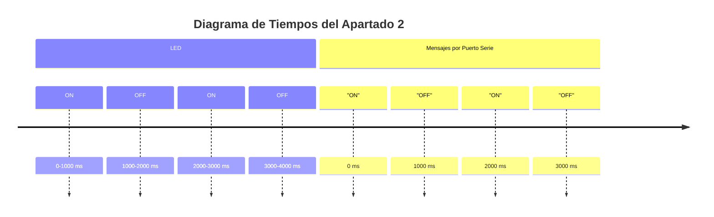

# Práctica 1: Blink con ESP32-WROOM-32D

Este proyecto hace parpadear un LED utilizando el microcontrolador ESP32-WROOM-32D y PlatformIO.

## Código
El código principal se encuentra en `src/main.cpp`.

## Diagrama de Flujo (Apartado 2)
```mermaid
flowchart TD
    A[Inicio] --> B[Configurar pin del LED como salida]
    B --> C[Iniciar puerto serie a 115200 baudios]
    C --> D[Bucle infinito]
    D --> E[Encender LED]
    E --> F[Enviar mensaje "ON" por puerto serie]
    F --> G[Esperar 1000 ms]
    G --> H[Apagar LED]
    H --> I[Enviar mensaje "OFF" por puerto serie]
    I --> J[Esperar 1000 ms]
    J --> D
```

## Diagrama de tiempos (Apartado 2)
## Diagrama de Tiempos



## Historial de Versiones

- **v1.0**: Versión inicial (Apartado 1). LED parpadea cada segundo.
- **v2.0**: Añadido envío de datos 'ON' y 'OFF' por el puerto serie (Apartado 2).