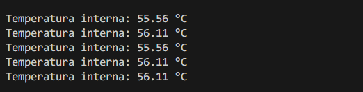
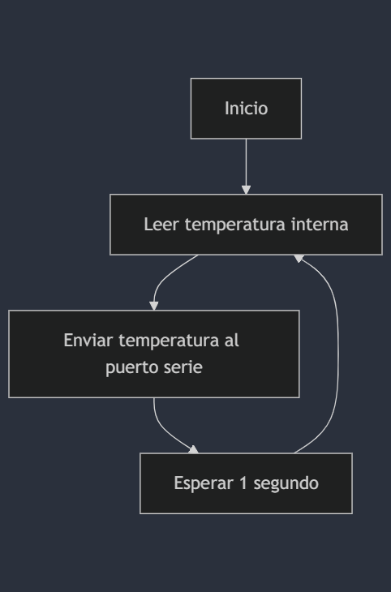
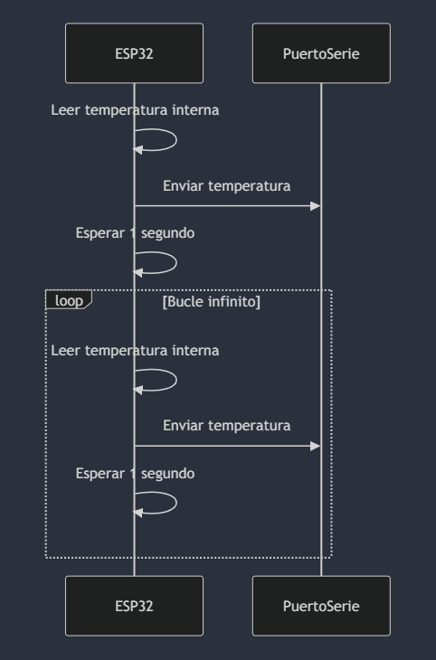

# Práctica 1: Blink con ESP32-WROOM-32D

Ejercicio 2 extra de la practica 1

Proyecto para leer la temperatura del sensor interno del procesador de la placa ESP32.

## Código
El código principal se encuentra en `src/main.cpp`.

Solo se han modificado los commit de los archivos que han variado con respecto al proyecto original de la practica 1.

Ejemplo salida monitor serie mostrando la temperatura interna:

## Diagrama de Flujo (Ejercicio 2 voluntario)

## Diagrama de tiempos (Ejercicio 2 voluntario)
