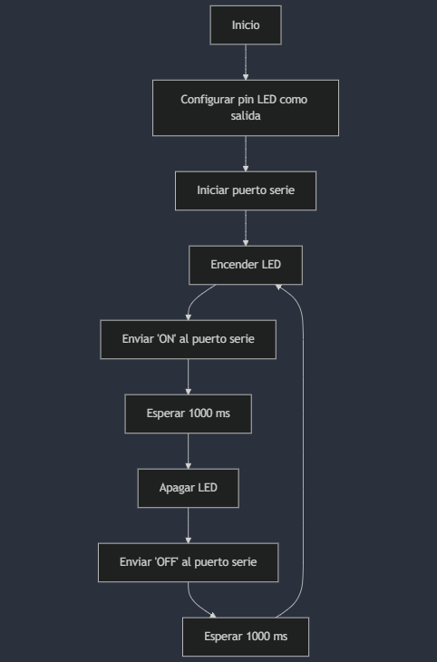
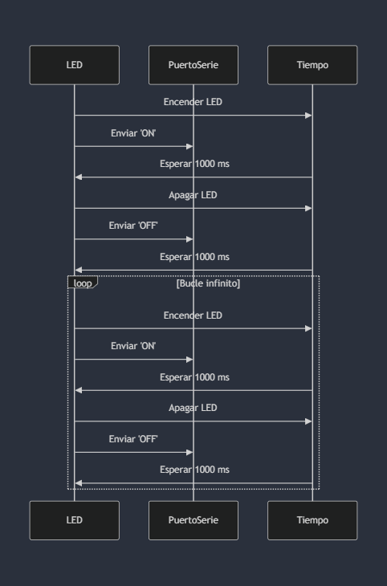

# Práctica 1: Blink con ESP32-WROOM-32D

Este proyecto hace parpadear un LED utilizando el microcontrolador ESP32-WROOM-32D y PlatformIO.

## Código
El código principal se encuentra en `src/main.cpp`.

## Diagrama de Flujo (Apartado 2)

## Diagrama de tiempos (Apartado 2)

## Historial de Versiones

- **v1.0**: Versión inicial (Apartado 1). LED parpadea cada segundo.
- **v2.0**: Añadido envío de datos 'ON' y 'OFF' por el puerto serie (Apartado 2).